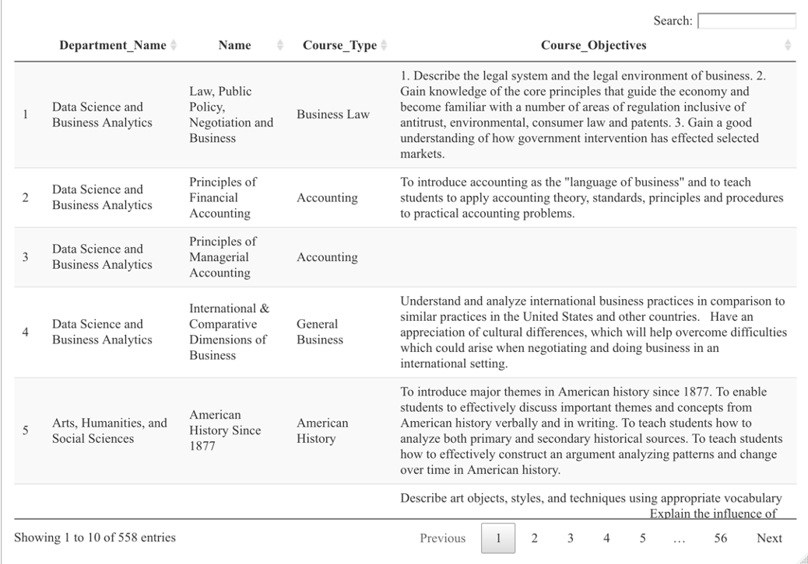
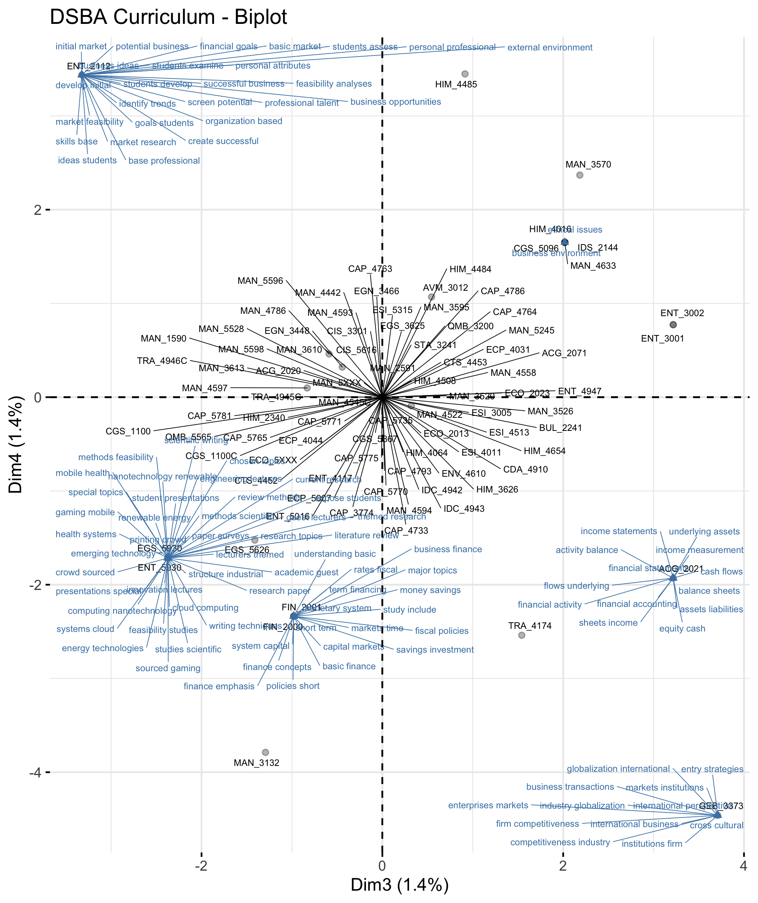
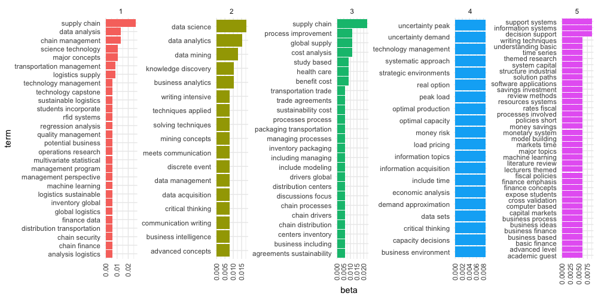
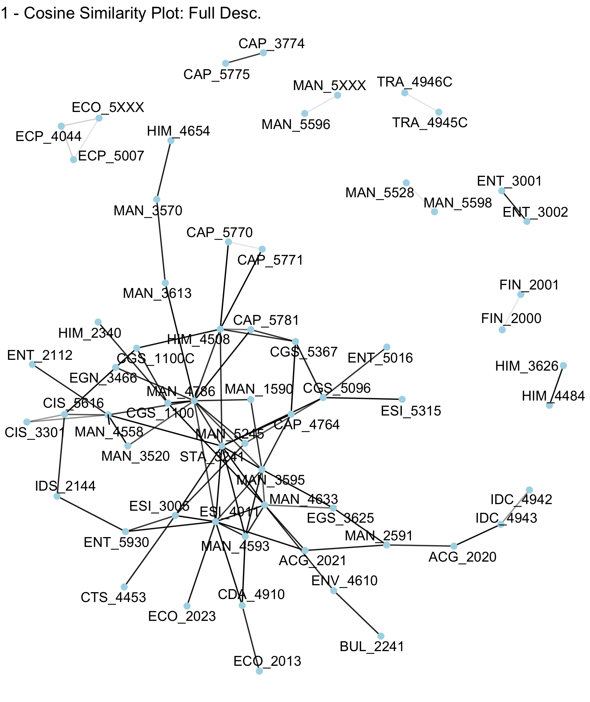
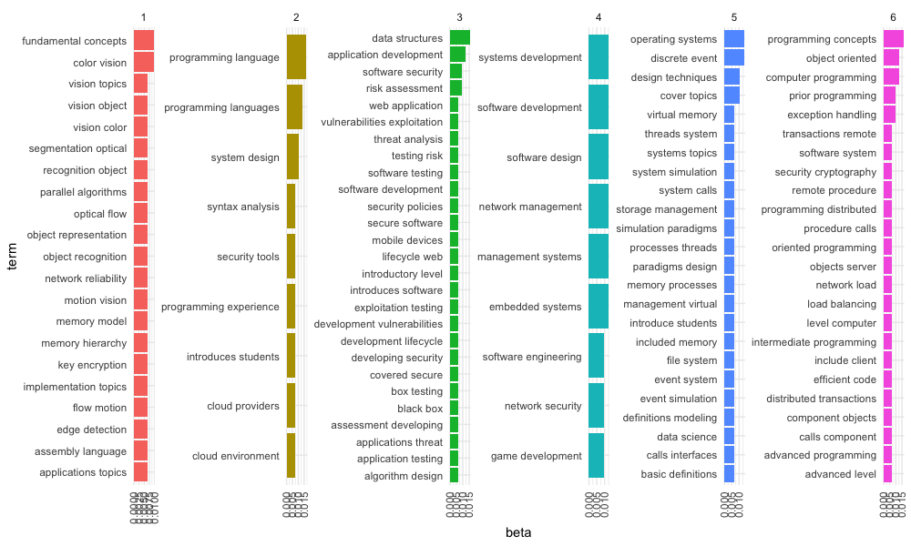
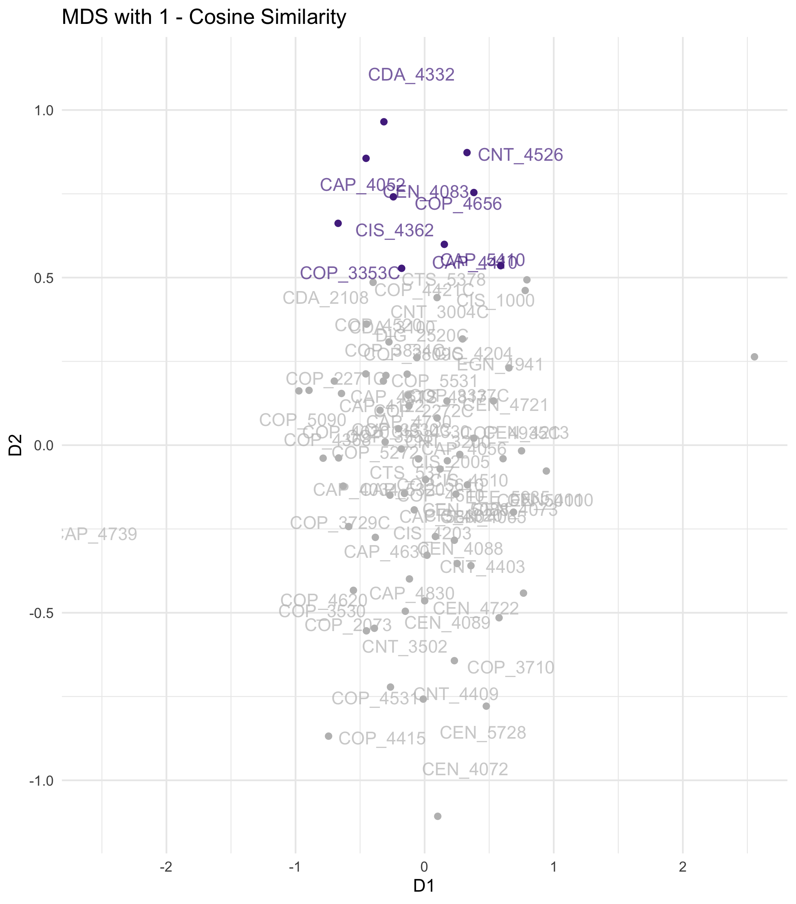

```{r setup, include=FALSE}
library(here)
library(readr)
library(dplyr)
knitr::opts_chunk$set(echo = FALSE)
```


class: inverse, center, middle
name: Intro

# Introduction

<html><div style='float:left'></div><hr color='#EB811B' size=1px width=796px></html>

---

# Introduction
## The Big Idea

One of the many methods in text mining and text visualization is to express the text as a **bi-gram**, skip-gram, or other n-gram graphs, but can these ideas be extended to *Learning Analytics* applications?


--

Through the use of **topic models**, text data can be assigned to topics based on the frequency of the words in that topic. **Document-term matrices** can be constructed to develop these topic models and compute distance between two bodies of text using distance and similarity metrics.

--

The application of interest here is to utilize these distance metrics to create **course-concept association graphs**, as well as to create lower-dimensional representations of the course data using **dimensionality reduction** with **MCA** and **MDS**.


---

# Introduction to the Data

There is one dataset used for this analysis, obtained from the registrar's office at [Florida Polytechnic University](http://floridapolytechnic.catalog.acalog.com) provided by Jay Hoying, M.Ed. Associate Registrar Office of the University Registrar. 

--

The FPU data includes information from every class offered at FPU. This includes information for department, course ID, course objectives, course descriptions, course outlines, and other features. The focus of the analysis here is on the Data Science and Business Analytics (DSBA) and the Computer Science (CS) Departments. 

---

# Introduction to the Data (cont.)
## FPU Course Catalog

- **Motivation:** These efforts and results support initiatives in FPU's University-wide catalog development. These courses are all courses that are currently offered at FPU, or that have been offered at FPU in the past. The course descriptions and outlines contain lots of information useful for characterizing coursework in a Learning Analytics framework.

- **Format and Collection:** the data is compiled into a single `.csv` file that was provided by Jay Hoying, M.Ed. Associate Registrar Office of the University Registrar.

```{r, out.width = "400px", echo  = FALSE, fig.align='center'}
# OPEN IN CHROME ONLY

```

---
class: inverse, center, middle
name: Methods

# Methods 

<html><div style='float:left'></div><hr color='#EB811B' size=1px width=796px></html>
---

# Methods


Creation of document -term matrices with course data for bigram creation. dimensionality reduction method applied to identify clusters of concepts with biplots. 

--

Course-concept association graph created with relevant techniques such as sparse factor analysis (sparfa), along with a measure for verifying the connections across topics/courses.

--

Creation of a proof-of-concept scripts and templates, utilizing these methods to be further iterated upon in future work and applied to the entire catalogs of data. 

---

# Methods
## Data Ingest & Text Preprocessing

The data is imported through a `.csv` and cleaned with a set of helper functions. These helper functions do everything from cleaning the column names to using regular expressions or `regex` to remove unnecessary words and features of the text data. For example, this could be a string character for $1.$ at the beginning of outlines.

This process uses popular packages from the R community such as `{dplyr}`, `{tidytext}`, and `{stringr}` (in addition to custom functions) to do data reformatting/reshaping, tokenization, and parsing of strings to properly treat the data before it moves to the next step.

The resulting data is then passed into the modeling methods by first creating Document-Term Matrices.

---
# Methods
## Document-Term matrix

In a Document-term matrix, rows correspond to documents in the collection and columns correspond to terms. This can then be fed into models like Latent Dirichlet Allocation for assigning topic representations alongside these words. In this case, we are using bi-grams as our terms and course outlines and descriptions as our topics.

```{r, message = FALSE, warning = FALSE, fig.align='center', out.align = 'center'}
read_csv(here("defense/images/bigram.csv")) %>% head(8) %>% kableExtra::kable( align = "c") %>%
  kableExtra::kable_styling(c("striped", "condensed"), 
                latex_options = "striped", 
                full_width = F)
```


---

# Methods (cont.)
## Computation of the Distance Metrics

The distance between two bodies of text is calculated through a number of distance metrics or similarity metrics. The two most performant metrics being:  

--
**Cosine Similarity**: 
$$ \cos (\theta) = \frac{A \cdot B}{|| A || || B||}$$
--
where $\theta$ is the angle between two vectors, denoting the similarity.  $||A||$ and $||B||$ are the Euclidean Norm or length of two vectors (in this case, course descriptions or course outline vectors). $A \cdot B$ is the dot product  between two course descriptions or course outlines. 

--
**Jaccard Similarity**  
$$\frac{A \cap B}{A \cup B}$$
--
where A and B are course descriptions or course outlines in vector form, and we are calculating the intersection divided by the union between the two vectors.
--


---

# Methods (cont.)  

**Latent Dirichlet Allocation (LDA)**  


Latent Dirichlet Allocation is a generative model that is used to generate a set of unobserved groups (topics) based on words collected into documents. In the context of text mining, this is called a **topic model**. For this research, the "unobserved" (by the data) groupings were the course concentrations of the specific plans of study where the document-term matrix of bigrams was used to create these groupings.   

--
**Multiple Correspondence Analysis (MCA)**   


Correspondence Analysis is used to generate latent space representations of the dynamics present in text data by utilizing distance metrics and the Singular Value Decomposition (SVD) respectively. Correspondence Analysis uses SVD to get latent space representations of text data,  where the new corresponding dimensions decrease successively in proportion of variance explained.  

--
**Multi-Dimensional Scaling (MDS)**  


MDS is another dimensionality reduction which allows for dynamic exploration of different distance metrics for use with text data, some of which are highly robust to features of text data.  


---

class: inverse, center, middle
name: Analysis

# Analysis

<html><div style='float:left'></div><hr color='#EB811B' size=1px width=796px></html>
---


# Analysis: DSBA Plan of Study
.pull-left[
First, MCA was performed on the document-term matrix of the course outline bigrams. Selecting the dimensions with the highest proportion of variance yields a smaller dimensional subset of the data in which the third and fourth dimensions can be viewed in the biplot on the right. 

]
.pull-right[
```{r, out.width = "475px", out.height="500px", echo  = FALSE,fig.align='center'}
# OPEN IN CHROME ONLY

```
]

---

# Analysis: DSBA Plan of Study  

LDA with Gibbs Sampling on the Course Description Bigrams
```{r, out.width = "850px", out.heigh="800px", fig.retina = 3, echo = FALSE, fig.align='center'}
# OPEN IN CHROME ONLY

```

---

# Analysis: DSBA Plan of Study
.pull-left[
Using cosine-similarity, we see how the courses compare to one another using the full course descriptions. The **darker** the line, the "closer" two courses are in cosine distance. 

Cosine distance is obtained by subtracting the cosine similarity from 1. 
]

--
.pull-right[
```{r, out.width = "500px", out.height="575px", fig.retina = 3, echo = FALSE, fig.align='center'}
# OPEN IN CHROME ONLY

```
]

---

# Analysis: DSBA Plan of Study
.pull-left[
Applying MDS yields the plot on the right. There are courses that group together for instance the top grouping, where ENT 3002 and EGS 5930.
]  

--
.pull-right[
```{r, out.width = "480px", out.height="550px", fig.retina = 3, echo = FALSE, fig.align='center'}
# OPEN IN CHROME ONLY
knitr::include_graphics("images/cos_mds.png")
```
]  

---

# Analysis: CS Plan of Study

Similar steps are done to the Computer Science Plan of Study. 
---

# Analysis: CS Plan of Study

```{r, out.width = "850px", out.heigh="800px", fig.retina = 3, echo = FALSE, fig.align='center'}
# OPEN IN CHROME ONLY

```

---

# Analysis: CS Plan of Study  

Topic 6 seems to most likely be either Software Engineering or Advanced Topics with terms like "object oriented" and "remote procedure" while topics 2 and 3 fit with Big Data 
Analytics and Cyber Security respectively. Topic 1 has terms that can be aligned with Autonomous Systems like "objection recognition", 
memory model", and "edge detection". 

---

# Analysis: CS Plan of Study

.pull-left[
COP 3338 (Object Oriented Programming) lay at the center of a lot of the computer science curriculum. We see from the cosine distance plot that it is very convenient in tracking the core courses within a department. 
]  

--
.pull-right[
```{r, out.width = "500px", out.height="575px", fig.retina = 3, echo = FALSE, fig.align='center'}
# OPEN IN CHROME ONLY
knitr::include_graphics("images/cos_cs.png")
```
]
---

# Analysis: CS Plan of Study

```{r, out.width = "480px", out.height="550px", fig.retina = 3, echo = FALSE, fig.align='center'}
# OPEN IN CHROME ONLY

```

---

# Analysis: CS Plan of Study


---
class: inverse, center, middle
name: Conclusion

# Conclusion

<html><div style='float:left'></div><hr color='#EB811B' size=1px width=796px></html>

---

# Conclusion


Learning Analytics and Unsupervised Learning methods were used as basis for developing course-concept association graphs.  There were numerous interesting takeaways gained from the 
analyses performed here, as well as many different downsides to each approach.  Additional analysis is needed to provide sufficient evidence to suggest 
non-linear course design,  however the groundwork is there for future analyses to determine so. 


--
We believe this  project resulted in contributions to the existing body of knowledge on these techniques applied to 
learning analytics, as well as to the University as a whole in providing a tangible body of work to be used by future 
students, faculty, and course planners.   


--
All of the methods are publically available on a [public GitHub repository](https://github.com/angel-sarmiento/sparse-learning-analytics). All code can be updated, adapted, recreated, and scrutinized; transparency and availability of these methods will benefit the software development and data science communities that use GitHub. The open sourcing of software leaves the work open, and leads to better open science for the community at large.  

---

class: inverse, center, middle
name: Future

# Future Development

<html><div style='float:left'></div><hr color='#EB811B' size=1px width=796px></html>
---

# Future Development  

--
As stated above,  the entire investigation is built on open-source technologies in the R ecosystem with all code published 
to Github. This allows the entire project to be cloned and iterated upon through future explorations of the techniques 
discussed. One specific upside of this is that the code can easily applied to course data from other degree programs at FPU. A simple line of code to a function allows the work here to be applied to any department, with data cleaning and utility functions that can be iterated on. See the appendix below for more.  


--
Some future implementations of this work can include approaches like BERTScores and OK scores as alternative distance 
approaches. Sparse Factor Analysis for an alternative to the network association graph creation. And other non-linear forms of dimensionality reduction.  


--
There is also the potential for this data to be available to students, either through a web application or publicly available GUI for use in course planning for their academic success.   
It would also be feasible to gain data on question-concept association graphs through sufficiently large databases of questions 
given to students over time that are characterized by the topics covered by those questions. This could potentially link student 
performance to their overall response to plans of study to adjust even further. 

---
# Acknowledgements

This work would not have been possible without the patience and support of my mentor and advisor, Dr. Reinaldo Sanchez-Arias. His example of excellence at what he does, as well as the patience and support in helping me figure who I am in this field, \\
are once in a lifetime contributions that I will never take for granted. I hope my dedication and commitment can meet and exceed even a fraction of yours some day.

Thanks to Dr. Shahram Taj who graciously agreed to be a part of the committee and gave me relevant feedback to better my work.

I would like to thank Florida Polytechnic University for their support, both in the form of scholarships and in the community that they foster on campus. I look forward to returning to campus and seeing how our small school is making a big impact. 

---

# Dedication

To my partner Amanda, who stuck with me throughout this entire Master's degree experience and helped me be who I am today. This would never have been possible without you.  

---

class: inverse, center, middle
name: End

# Any Questions?

<html><div style='float:left'></div><hr color='#EB811B' size=1px width=796px></html>

---

class: inverse, center, middle
name: Close

# Thank you!!

<html><div style='float:left'></div><hr color='#EB811B' size=1px width=796px></html>

---

# References

--- 

Available at GitHub [here](https://github.com/angel-sarmiento/sparse-learning-analytics/blob/main/final-doc/main.pdf#appendix)
